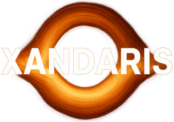

# ☄️ https://xandaris.space

Xandaris is a space trading and exploration game written in Go using the [Ebitengine](https://github.com/hajimehoshi/ebiten/v2) game library.

### ⚠️ Xandaris is in EARLY DEVELOPMENT, many features are unfinished.

## Controls

### Global
| Action | Key |
| --- | --- |
| Pause/Resume | Space |
| Speed: Slow | 1 |
| Speed: Normal | 2 |
| Speed: Fast | 3 |
| Speed: Very Fast | 4 |
| Quick Save | F5 |

### Navigation
| Action | Key |
| --- | --- |
| Escape/Back | Escape |
| Open Build Menu | B |
| Open Market | M |
| Open Player Directory | P |
| Focus Home System | Tab |
| Toggle Workforce View | W |

### Menus
| Action | Key |
| --- | --- |
| Menu: Up | Up Arrow |
| Menu: Down | Down Arrow |
| Menu: Confirm | Enter |
| Menu: Cancel | Escape |
| Menu: Delete | Backspace |
