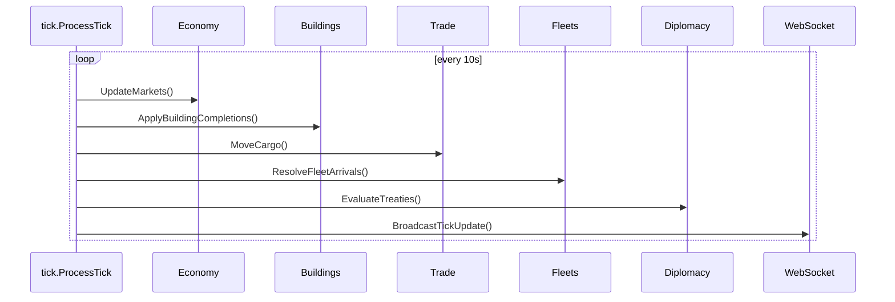
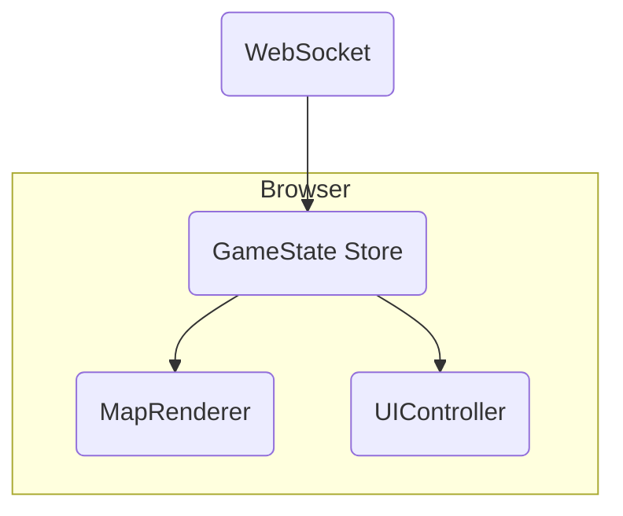

# Architecture Overview

Xandaris is structured as a real-time 4X strategy game with a Go backend and a vanilla JS frontend. The backend uses **PocketBase** for the REST API, database access and authentication. A 10‑second tick loop processes the game simulation and pushes updates to the client over WebSocket.

```
+-------------+          HTTP / WS           +--------------+
|  Frontend   |  <------------------------>  |    Backend   |
|  (Browser)  |                              |  (Go + PB)   |
+-------------+                              +--------------+
                                                    |
                                                    | SQLite
                                                    v
                                              +-----------+
                                              | Database  |
                                              +-----------+
```

## Game Tick Processing
The core of the game runs on a continuous tick that executes six times per minute. Each tick increments the global tick counter and performs several subsystems.



### Subsystem Details
- **Economy** (`internal/economy`)
  - Iterates colonized planets with populations.
  - Calculates building production and resource consumption.
  - Applies population growth/decline and happiness effects.
- **Buildings** (`internal/tick.ApplyBuildingCompletions`)
  - Placeholder for a future building queue; currently buildings complete instantly.
- **Trade Routes** (`internal/tick.MoveCargo`)
  - Moves cargo between systems and schedules the next ETA.
- **Fleets** (`internal/tick.ResolveFleetArrivals`)
  - Checks fleets whose `eta` is in the past, moves them to the destination system and logs arrival.
- **Diplomacy** (`internal/tick.EvaluateTreaties`)
  - Expires treaties whose `expires_at` time has passed.
- **WebSocket Broadcast** (`internal/websocket`)
  - Sends a `tick` message to all connected clients after processing.

## Frontend Integration
The browser client uses the PocketBase JS SDK and connects to the WebSocket endpoint to receive live updates.

```
GameDataManager.connectWebSocket()
        |
        v
   ws://<server>/api/stream
```

On each tick broadcast the client updates its internal `GameState` store which then refreshes the canvas renderer and UI components.



User actions (build orders, fleet movement, trade route creation) are sent via REST endpoints defined in `pkg/api.go`. When a user queues an action it is stored in the database and picked up by the next tick.

## Gameplay Loop
A simplified technical loop tying everything together is illustrated below.

```
[Player] --click/keystroke--> [Frontend JS] --REST--> [PocketBase API]
      |                                               |
      |                                   writes/read from SQLite
      |                                               v
      |                                        [Game Tick]
      |                                               |
      <-- WS updates --------------------------- [WebSocket Hub]
```

1. **Player Action** – The user interacts with the UI which calls a PocketBase endpoint (e.g. `/api/orders/build`).
2. **Database Update** – The backend validates the request and creates or updates records in SQLite.
3. **Tick Execution** – Every 10 seconds `tick.ProcessTick` runs and processes all queued actions and simulation logic.
4. **Real-Time Push** – Results of the tick (system changes, fleet updates) are sent to clients through the WebSocket hub.
5. **Frontend Refresh** – `GameState` receives updates and re-renders the map and UI so the player sees changes almost instantly.

### Data Collections
Key collections driving this loop:
- `systems`, `planets`, `populations`, `buildings`, `fleets`, `trade_routes`, `treaties`
- Reference data: `planet_types`, `building_types`, `ship_types`, `resource_types`

Each tick touches many of these collections to compute new values and store the latest game state.

## Running the Loop
To run locally:
```bash
cd backend
go build -o xandaris cmd/main.go
./xandaris serve --dev --dir=pb_data
```
This starts the PocketBase server and begins the continuous tick processor. The frontend (`npm run dev` inside `frontend/`) connects to `ws://localhost:8090/api/stream` and begins updating once data flows.


